# BlockchainTP

This is an educational purpose exercise and so the code is not optimized. 
The purpose is to create a _NFT game_. 

## Prerequisite

You need a [MetaMask account](https://metamask.io/) and to switch your wallet to Ropsten Test Blockchain.

## Setup 

1. First we need to get the code to deploy it.
    * You can either download the whole code from github or with the `git clone` shell command. 
    * Or you can simply just copy/paste the code.

2. Then open a tab in your browser and go to the [Remix Ethereum IDE](https://remix.ethereum.org/).
    * Create **2** new files with the **.sol** extension, in the **contracts** folder.
    * Name them _EPFToken.sol_ and *NFT_Project.sol*
    * Now click on the _EPFToken.sol_ file in the github repository and copy/paste the code in the Remix one.
    * Do the same for *NFT_Project.sol*

_(Be sure to deploy the EPFToken first, we need it to create new characters!)_

3. Open the SOLIDITY COMPILER tab.
    * Select the compiler version 0.8.0
    * Click on the __Compile EPFToken.sol__ button.

4. Open the DEPLOY & RUN TRANSACTIONS tab.
    * You can select whatever fake Environment you want.
    * In Contract select _ERC20Spendable - contracts/EPFToken.sol_ 
    * Click deploy.

5. Redo 3. and 4. for the *NFT_Project.sol* file.
    * In Contract select *newNFT - contracts/NFT_Project.sol* 

## Demo

1. Copy the address of your wallet (you're going to need it a lot!).
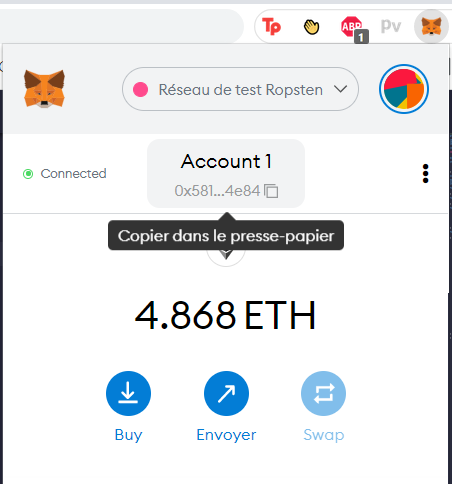

2. In the DEPLOY & RUN TRANSACTIONS tab, you have the functions of the contracts. Open the ERC20 contract and paste your address in the `mint` function in order to get 200 Tokens. Click transact button.
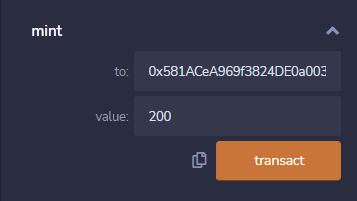

You can verify that you get your tokens with the `balanceOf` function.

3. Open the newNFT contract and paste your address and the address of the ERC20 contract in the `generateCharacter` function in order to generate a character. You can use the same values on screeshots or not. Click transact button.
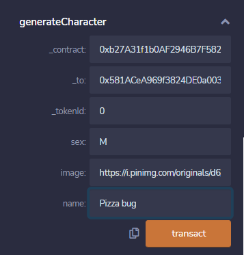

4. You can verify that you paid 20 Tokens.
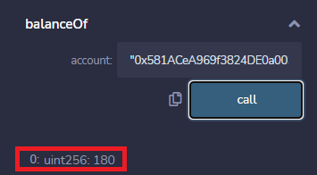

5. You can check that your monster is created with the `getMonster` function.
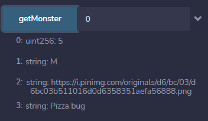

6. Generate a second character for the demo.
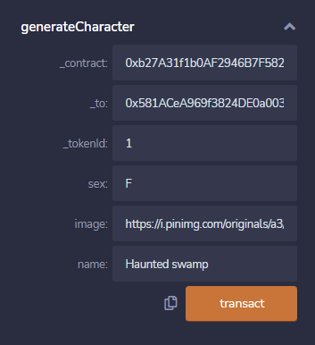

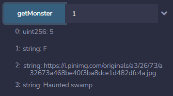

7. You can test the `fight` function and see that the winner was rewarded with a new level of strength.
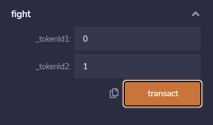

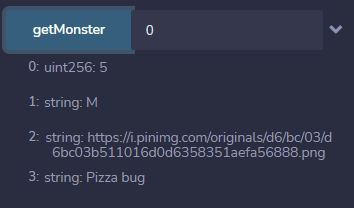

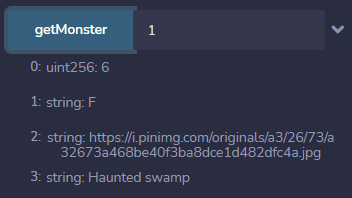

8. Finally you can test the `breeding` function to get a new monster from two parents monsters.
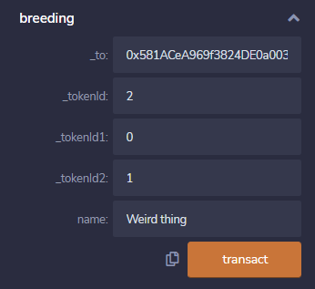

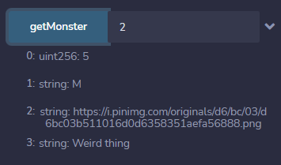
